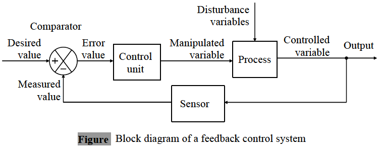

# Curso: Modelación de sistemas físicos

## Semestre
> Enero 2023

## Impartido por:
<ul>
  <li> Dr. Jesús Emmanuel Solís Pérez </li>
  <li> Email: jsolisp@unam.mx </li>
</ul>

## Página personal del profesor
> [https://sites.google.com/view/je-solis-perez](https://sites.google.com/view/je-solis-perez)

## Prerequisitos
<ol>
 <li>Dinámica de Sistemas Físicos </li>
</ol>

## Software requerido y herramientas
<ol>
 <li>Python & Jupyter Notebook </li>
 <li>Sistema operativo: Windows 10, Linux, o macOS.</li>
 <li>Web Browser: Google Chrome, Opera o Firefox.</li>
 <li>Markdown para escribir documentación.</li>
 <li>Sistema de control de versiones.</li>
</ol>

## Contenido del curso

| **Unidad** | **Tema** | **Contenido** | **Material** |
|:---:|:---:|:---|:---:|
| I | Introducción al análisis de la dinámica de sistemas | <li>Ejemplos prácticos.</li> | <ol><li>[Código (Live Script)](codes/JESP_01_Introduccion_analisis.ipynb)</li> <li>[PDF](pdf/.pdf)</li> </ol> |
| II | Antecedentes matemáticos | <li> Ecuaciones diferenciales no lineales. </li> <li> Análisis de la existencia, unicidad y continuidad de soluciones. </li> | <ol><li>[Código (Live Script)](codes/JESP_02_Antecedentes_mat.ipynb)</li> <li>[PDF](pdf/.ipynb)</li> </ol> |
| III | Fundamentos del análisi de estabilidad en el sentido de Lyapunov | <li> Localización de los puntos de equilibrio. </li> <li> Estabilidad de los puntos de equilibrio. </li> <li> Linealización de sistemas en torno a un punto de equilibrio. </li> <li> Análisis de la estabilidad de sistemas dinámicos linealizados. </li> <li> Análisis de estabilidad por el método directo de Lyapunov. </li> | <ol><li>[Código (Live Script)](codes/JESP_03_Fundamentos_estabilidad.ipynb)</li> <li>[PDF](pdf/.pdf)</li> </ol> |
| IV | Controlabilidad de sistemas dinámicos | <li> Concepto de controlabilidad. </li> <li> Condiciones para la controlabilidad. </li> <li> Formas canónicas de controlabilidad. </li> | <ol><li>[Código (Live Script)](codes/JESP_04_Controlabilidad_sistemas.ipynb)</li> <li>[PDF](pdf/.pdf)</li> </ol> |
| V | Observabilidad de sistemas dinámicos | <li> Concepto de observabilidad. </li> <li> Teorema de dualidad. </li> <li> Fromas irreductibles de un sistema dinámico. </li> | <ol><li>[Código (Live Script)](codes/JESP_05_Observabilidad_sistemas.ipynb)</li> <li>[PDF](pdf/.pdf)</li> </ol> |
| VI | Identificación de sistemas dinámicos | <li> Objetivo del problema de identificación. </li> <li> Representación de sistemas dinámicos en forma lineal con respecto a los parámetros. </li> <li> Métodos de estimación de parámetros. </li> <li> Diseño de experimentos para la identificación paramétrica. </li> | <ol><li>[Código (Live Script)](codes/.ipynb)</li> <li>[PDF](pdf/.pdf)</li> </ol> |

## Libros de apoyo
<ol>
 <li> Nise, N. S. (2020). Control systems engineering. John Wiley & Sons. </li>
 <li> Khalil, H. K. (2002). Nonlinear systems third edition. Patience Hall, 115. </li>
 <li> Slotine, J. J. E., & Li, W. (1991). Applied nonlinear control (Vol. 199, No. 1, p. 705). Englewood Cliffs, NJ: Prentice hall. </li>
 <li> Johansson, R. (1993). System modeling and identification. Prentice-hall. </li>
</ol>

##### Última modificación 23 de diciembre de 2022
